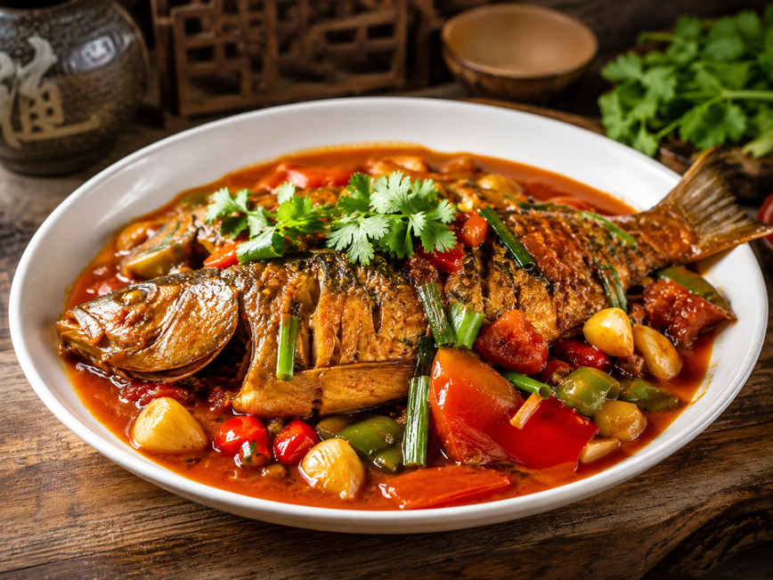
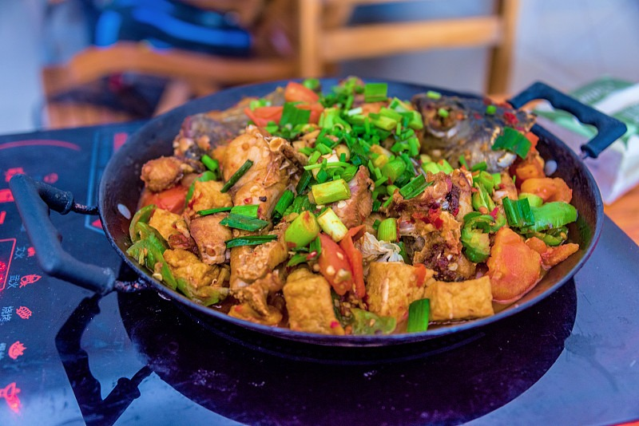

# 阳朔啤酒鱼的做法

阳朔啤酒鱼是广西阳朔的地方名菜，选用漓江鲜鱼不去鳞，以啤酒代水焖煮，鱼鳞酥脆、鱼肉鲜嫩、啤酒香浓郁。一般 30 分钟即可完成。

预估烹饪难度：★★★

## 必备原料和工具

- 剑骨鱼或鲤鱼（约 1.5 斤，让店家处理内脏，但**不要刮鱼鳞**）
- 漓泉啤酒（一瓶，约 330ml，桂林本地啤酒，最正宗）
- 番茄（2 个）
- 青椒（2 个）
- 红椒（1 个）
- 大蒜（5-6 瓣）
- 生姜（1 块）
- 葱（2 根）
- 桂林辣椒酱
- 料酒
- 生抽
- 老抽
- 白糖
- 食盐
- 食用油

## 计算

每份：

- 剑骨鱼或鲤鱼 1 条（约 750g，不去鳞）
- 料酒 15ml
- 漓泉啤酒 330ml（1 瓶）
- 番茄 2 个（约 300g）
- 青椒 2 个（约 150g）
- 红椒 1 个（约 80g）
- 大蒜 6 瓣（约 30g）
- 生姜 1 块（约 20g）
- 葱 2 根（约 40g）
- 桂林辣椒酱 15g
- 生抽 15ml
- 老抽 5ml
- 白糖 5g
- 食盐 5g
- 食用油 30ml

## 操作

1. 鱼处理好内脏，保留鱼鳞，清洗干净，从腹部剖开成两半（背部相连），用 15ml 料酒、姜片、食盐 3g 腌制 15 分钟
2. 番茄切块，青椒红椒切块，大蒜拍碎，生姜切片，葱切段（葱白葱叶分开）
3. 用姜片擦拭锅底，热锅后倒入 30ml 食用油，油热后放入鱼（鱼皮朝下），煎至两面金黄、鱼鳞酥脆，盛出备用
4. 锅中留底油，放入葱白、姜片、蒜瓣爆香
5. 加入 15g 桂林辣椒酱，炒出红油
6. 放入番茄块，翻炒至番茄出汁变软
7. 倒入整瓶啤酒，加入 15ml 生抽、5ml 老抽、5g 白糖、5g 食盐，搅拌均匀
8. 放入煎好的鱼，大火烧开后转中小火，盖上锅盖焖煮 15-20 分钟
9. 开盖，放入青椒红椒块，继续煮 3-5 分钟
10. 大火收汁至汤汁浓稠，撒上葱叶段，出锅装盘

## 附加内容

- 鱼鳞是这道菜的关键特色，一定要保留，煎炸后会变得酥脆可口
- 鱼剖成两半更容易煎透入味，比整条划刀效果更好
- 正宗做法使用桂林辣椒酱（非郫县豆瓣酱），搭配漓泉啤酒，没有桂林辣椒酱可以用蒜蓉辣酱代替
- 番茄要炒软出汁，这样汤汁更浓郁
- 汤汁不要收太干，留一些拌饭或拌面非常好吃
- 参考资料：[阳朔啤酒鱼的做法](https://www.bilibili.com/video/BV1rt4y1976z)

如果您遵循本指南的制作流程而发现有问题或可以改进的流程，请提出 Issue 或 Pull request 。
