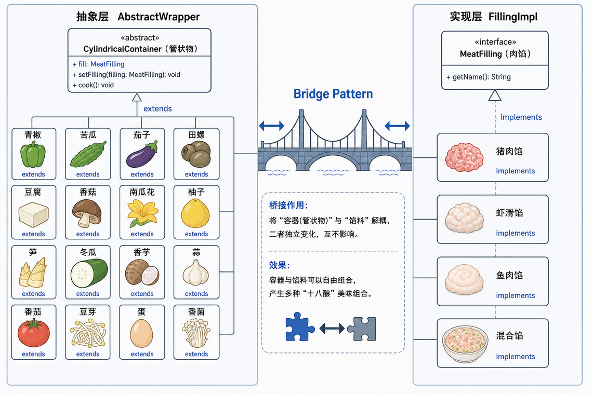
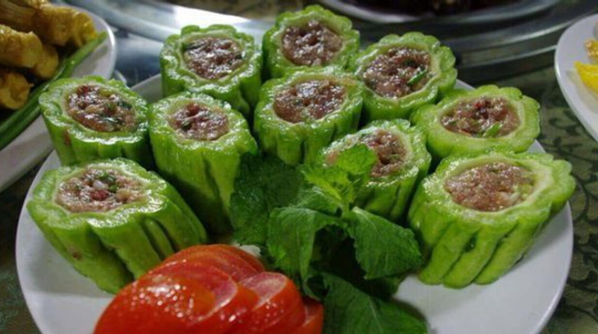
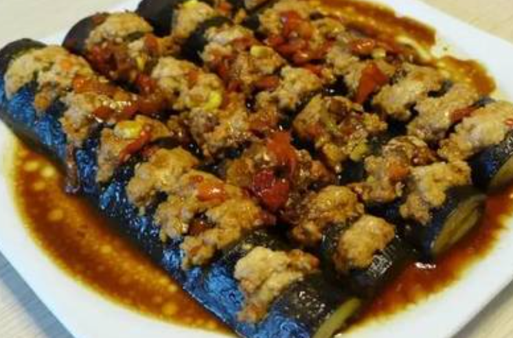
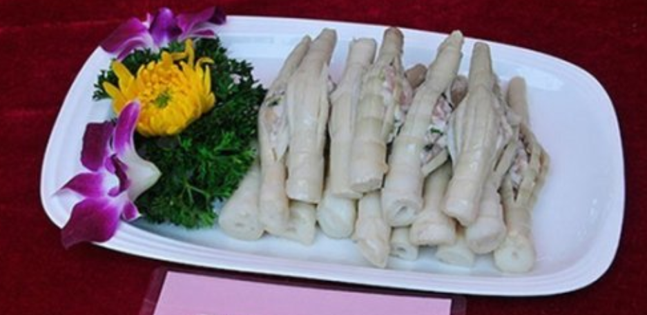
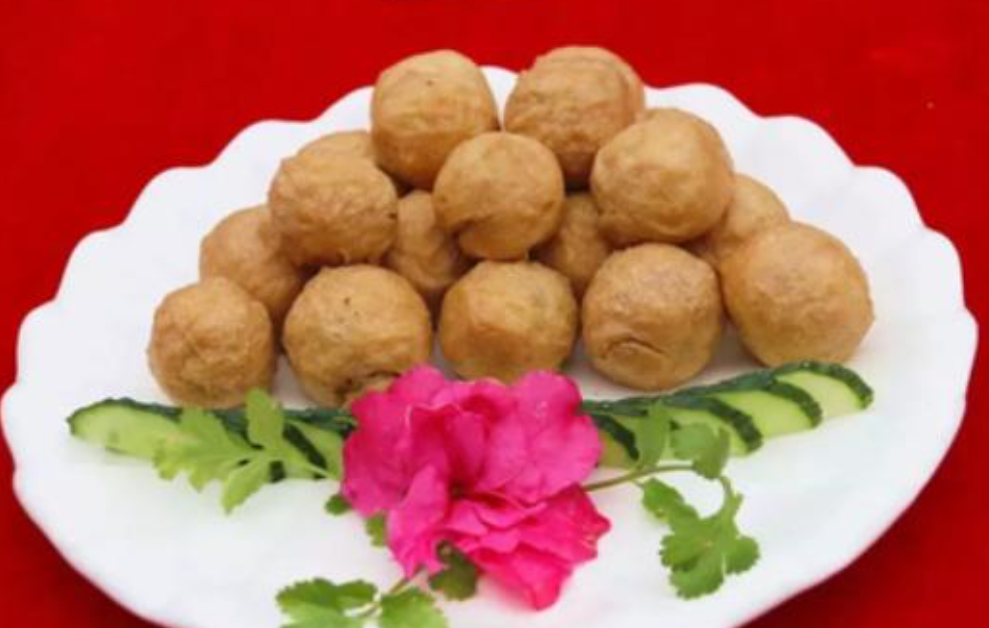
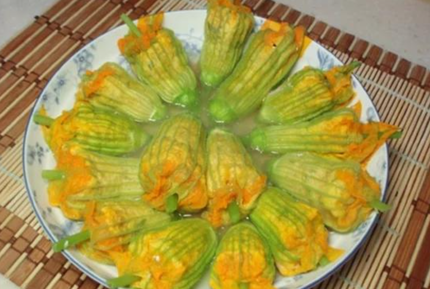

# 桂林十八酿的做法



桂林十八酿是广西桂林地区的经典酿菜系列，将调好味的肉馅酿入各种食材中，或煎或焖，风味各异。当地有"无酿不成席"的说法，2016 年入选市级非物质文化遗产。

预估烹饪难度：★★★

## 必备原料和工具

**容器(Wrapper)—— 管状物即可：**

- 青椒、苦瓜、茄子、田螺、豆腐、香菇、南瓜花
- 柚子、笋、冬瓜、香芋、蒜、番茄、豆芽、蛋、香菌
- 原则：万物皆可酿

**馅料(Filling)—— 肉馅为主：**

- 猪肉馅（基础款，肥瘦比例 3:7）
- 虾滑馅（fork 版本）
- 鱼肉馅
- 混合馅（猪肉 + 虾滑，猪肉 + 螺肉等自由组合）

## 计算

18 种容器 × 4 种馅料 = 72 种组合，实际常用组合约 20 余种。

核心公式：**管状物 + 肉馅 + 煎/焖 = 酿**

## 操作

### 核心思路

所谓"酿"，就是找一个中空的管状食材作为容器，把调好味的肉馅塞进去，再煎或焖熟。

以两道已收录的酿菜为例：

1. **青椒酿**：青椒去籽挖空 → 塞入猪肉馅或虾滑 → 煎至虎皮色 → 酱汁焖煮
2. **田螺酿**：田螺焯水取肉 → 螺肉与猪肉剁碎混合 → 塞回螺壳 → 紫苏薄荷焖煮

换成其他管状食材，同样的工序再来一遍，就是一道新菜。苦瓜酿、茄子酿、豆腐酿……皆是如此。

酿心（馅料）同样可以变化：

3. **猪肉馅**：最基础通用的选择，肥瘦 3:7 口感最佳
4. **虾滑馅**：鲜甜弹牙，青椒酿里常用
5. **螺肉猪肉混合馅**：田螺酿的灵魂，螺肉与猪肉 1:1，加紫苏薄荷
6. **混合馅**：猪肉 + 虾滑混搭，鲜甜与油脂香兼得

一个容器配一种馅，换一个就是一道新酿。当地有"万物皆可酿"的说法，正是这个道理。

### 桥接模式(Bridge Pattern)

将"容器"与"馅料"解耦，二者独立变化、自由组合：

```text
抽象层（Abstract Wrapper）：管状物（CylindricalContainer）
    ├── 青椒酿 extends CylindricalContainer
    ├── 苦瓜酿 extends CylindricalContainer
    ├── 茄子酿 extends CylindricalContainer
    ├── 螺蛳酿 extends CylindricalContainer
    ├── 豆腐酿 extends CylindricalContainer
    ├── 香菇酿 extends CylindricalContainer
    ├── 南瓜花酿 extends CylindricalContainer
    ├── 柚子酿 extends CylindricalContainer
    ├── 笋酿 extends CylindricalContainer
    ├── 冬瓜酿 extends CylindricalContainer
    ├── 香芋酿 extends CylindricalContainer
    ├── 蒜酿 extends CylindricalContainer
    ├── 番茄酿 extends CylindricalContainer
    ├── 豆芽酿 extends CylindricalContainer
    ├── 蛋酿 extends CylindricalContainer
    ├── 香菌酿 extends CylindricalContainer
    └── ... 万物皆可酿

实现层（Filling Implementation）：肉馅（MeatFilling）
    ├── 猪肉馅 implements MeatFilling
    ├── 虾滑馅 implements MeatFilling
    ├── 鱼肉馅 implements MeatFilling
    └── 混合馅 implements MeatFilling  // 猪肉 + 虾滑，猪肉 + 螺肉...
```

换一个 wrapper 就是一道新菜，换一种 filling 又是一个变体。

## 附加内容

### 已有菜谱

- [青椒酿](../青椒酿/青椒酿.md) — 青椒酿肉 / 虾滑酿青椒（fork 版本）
- [田螺酿](../田螺酿/田螺酿.md) — 螺肉猪肉 1:1，配紫苏薄荷

### 酿菜图鉴







如果您遵循本指南的制作流程而发现有问题或可以改进的流程，请提出 Issue 或 Pull request 。
