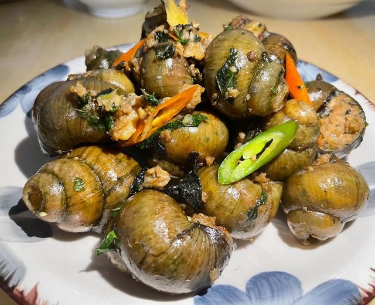
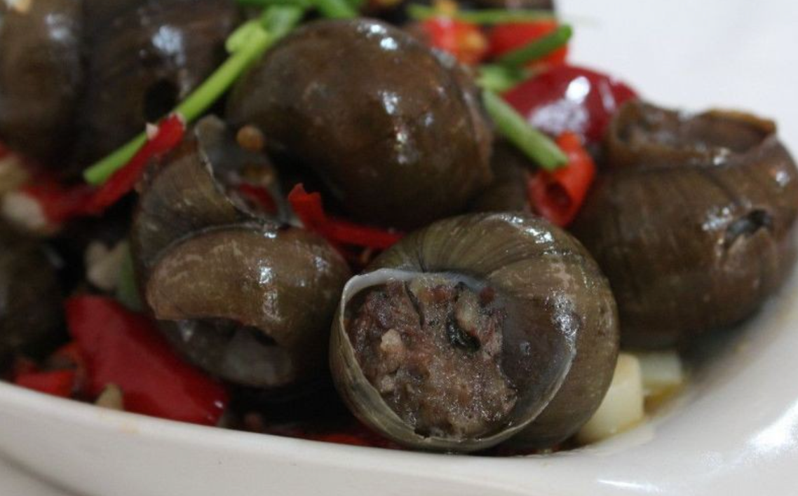
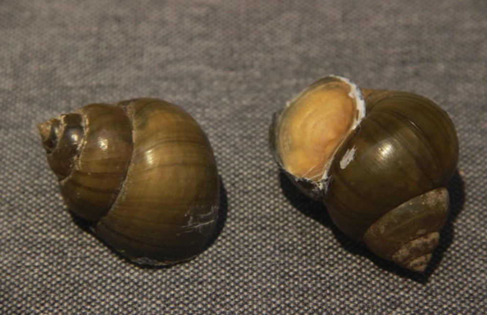
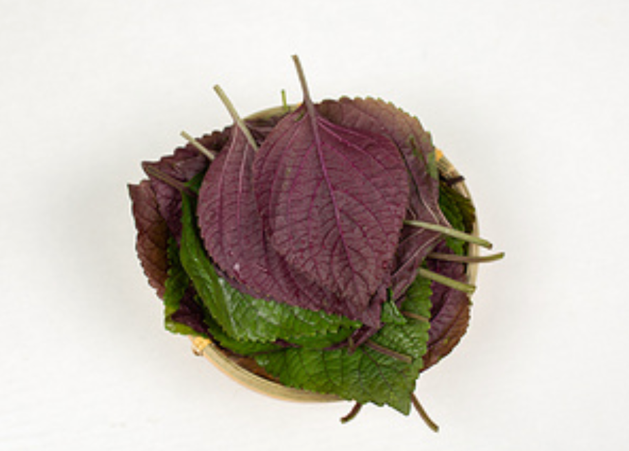
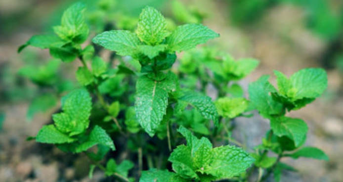

# 田螺酿的做法

田螺酿是阳朔"十八酿"中最负盛名的一道，将田螺肉与猪肉剁碎调味后回填螺壳焖煮，螺肉韧而紧致、猪肉嫩滑，紫苏薄荷清香扑鼻。曾登上《舌尖上的中国 2》。属于节假日才做的重菜，上午买螺回家放一下午吐沙即可，制作耗时约 40 分钟。

预估烹饪难度：★★★★

## 必备原料和工具

- 大田螺（乒乓球大小，约 20-25 个，上午买回放一下午吐沙）
- 猪肉（250g，肥瘦比例 3:7 的前夹肉最佳）
- 新鲜薄荷叶（一小把，点睛之笔）
- 紫苏叶（一小把，与田螺是绝配）
- 生姜（1 小块）
- 葱（2 根）
- 桂林三花酒
- 生抽
- 食盐
- 食用油
- 酸笋（可选，50g）
- 大蒜（可选，4-5 瓣）
- 干辣椒（可选，3-4 个）
- 蚝油（可选）
- 淀粉（可选）
- 白胡椒粉（可选）

## 计算

每份（2-3 人）：

- 大田螺 20 个（约 1000g）
- 猪肉 250g
- 新鲜薄荷叶 10g
- 紫苏叶 10g
- 生姜 1 小块（约 15g）
- 葱 2 根（约 30g）
- 桂林三花酒 15ml
- 生抽 30ml（其中 15ml 调馅、15ml 调味汤汁）
- 食盐 5g
- 食用油 30ml
- 酸笋 50g（可选）
- 大蒜 5 瓣（可选，约 20g）
- 干辣椒 4 个（可选）
- 蚝油 10ml（可选）
- 淀粉 10g（可选）
- 白胡椒粉 2g（可选）

## 操作

### 吐沙（提前半天）

1. 上午买回田螺，放入清水盆中，静置一下午吐沙
2. 可在水中滴几滴香油（或者芥末~）加速吐沙

### 处理田螺

1. 用刷子将田螺外壳刷洗干净（这一步可以时间久一些）
2. 用老虎钳或菜刀剪去田螺尾部（约剪掉 1/3 到一半）
3. 大锅烧水，水开后放入田螺焯烫 1-2 分钟（时间不可太久，螺肉会老）
4. 捞出后用牙签挑出螺肉，去掉螺盖和黑色泥肠
5. 螺壳用水冲洗干净，甩干水分备用

### 制作馅料

1. 螺肉用盐抓洗干净，剁成碎粒（不要剁成泥，保留颗粒感才有嚼头）
2. 猪肉剁成肉末
3. 薄荷叶、紫苏叶切碎，姜切末，葱切葱花

4. 将螺肉碎、猪肉末、薄荷碎、紫苏碎、姜末、葱花放入碗中
5. 加入三花酒 15ml、生抽 15ml、食盐 3g
6. 可选加入：蚝油 10ml、白胡椒粉 2g、淀粉 10g
7. 朝一个方向搅拌至馅料粘稠上劲
8. 图省事上面的所有东西直接放入打肉机直接打。

### 酿制

1. 将馅料用筷子塞入田螺壳中，尽量塞满塞紧，但不要撑破螺壳
2. 依次酿完所有田螺

### 焖煮

1. 热锅，倒入 30ml 食用油，可选放入酸笋和干辣椒炒出香味
2. 倒入清水或高汤约 300ml，加生抽 15ml、食盐 2g，大火烧开
3. 将酿好的田螺放入锅中，盖上锅盖，中小火焖煮 10 分钟
4. 焖煮过程中不要频繁翻动，等肉馅六七成熟定型后再轻轻翻动
5. 开盖，放入剩余的新鲜薄荷叶和紫苏叶，再焖 2-3 分钟
6. 大火收汁至汤汁浓稠，即可出锅

## 附加内容

- 食用方法：先吮吸壳内汤汁，再用牙签挑出或用嘴猛吸出肉馅——"嗦螺贴唇猛吸气"
- 螺肉和猪肉最佳比例为 1:1
- 薄荷是这道菜的精华，紫苏配田螺是绝配，两者至少要有其一
- 没有三花酒可用料酒代替，但风味会打折扣
- 焯水时间一定要短，久了螺肉变老发硬
- 搭配冰镇漓泉啤酒是阳朔当地的标准吃法
- 参考资料：[阳朔田螺酿_百度百科](https://baike.baidu.com/item/%E9%98%B3%E6%9C%94%E7%94%B0%E8%9E%BA%E9%85%BF/3035090)

如果您遵循本指南的制作流程而发现有问题或可以改进的流程，请提出 Issue 或 Pull request 。
