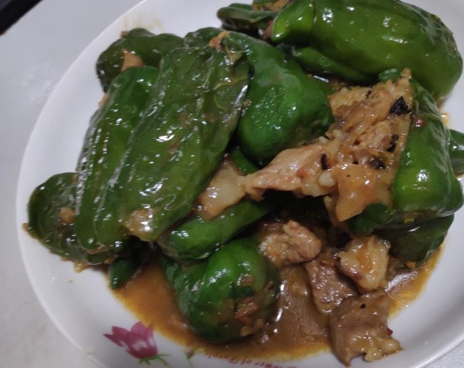
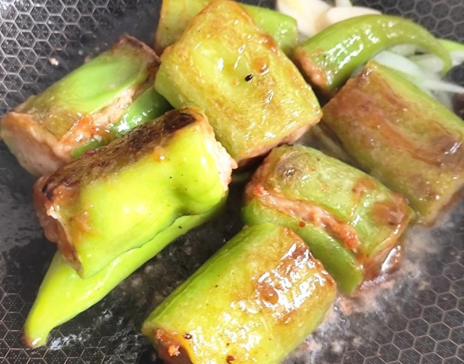
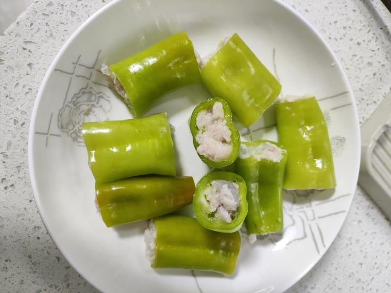

# 青椒酿的做法

青椒酿是广西经典家常菜，将调好味的肉馅或虾滑酿入青椒中，煎至虎皮色后焖煮入味，青椒清香与馅料鲜美交融，咸香微辣，十分下饭。汤汁浇在饭上非常之美味。一般 30 分钟即可完成。

预估烹饪难度：★★★

## 必备原料和工具

- 青椒（6-8 个，选笔直、肉厚的，不要用灯笼菜椒）
- 猪肉（250g，肥瘦比例 3:7 的前夹肉最佳）
- 葱（2 根）
- 生姜（1 小块）
- 生抽
- 老抽
- 食盐
- 食用油
- 淀粉（可选，涂青椒内壁防粘、勾芡收汁）
- 大蒜（可选，3-4 瓣）
- 蚝油（可选）
- 料酒（可选）
- 鸡蛋（可选）
- 白胡椒粉（可选）
- 白糖（可选）

## 计算

每份：

- 青椒 8 个（约 400g，选笔直肉厚的尖椒）
- 猪肉馅 250g（肥瘦比例 3:7）
- 葱 2 根（约 30g）
- 生姜 1 小块（约 10g）
- 生抽 30ml（其中 15ml 调馅，15ml 调酱汁）
- 老抽 5ml
- 食盐 3g
- 食用油 30ml
- 淀粉 10g（可选，其中 5g 涂青椒内壁、5g 水淀粉勾芡）
- 大蒜 4 瓣（可选，约 15g）
- 蚝油 10ml（可选）
- 料酒 10ml（可选）
- 鸡蛋 1 个（可选）
- 白胡椒粉 2g（可选）
- 白糖 5g（可选）

## 操作

### 准备馅料

1. 猪肉洗净剁成肉馅（或用绞肉机），姜切末，葱切葱花
2. 肉馅中加入姜末、葱花、生抽 15ml、老抽 5ml、食盐 3g，搅拌均匀
3. 可选加入：料酒 10ml、蚝油 10ml、鸡蛋 1 个、淀粉 5g、白胡椒粉 2g、白糖 5g
4. 朝一个方向搅拌肉馅至粘稠上劲，腌制 10 分钟

### 处理青椒

1. 青椒洗净，去蒂，用筷子小心挖去内部的籽和白筋，保持青椒完整不破
2. 可选在青椒内壁撒干淀粉约 5g，摇晃均匀，帮助肉馅粘附不脱落

### 酿入肉馅

1. 将腌好的肉馅用筷子或裱花袋塞入青椒中，尽量填满但不要太紧以防撑破
2. 全部酿好后备用

### 调酱汁

1. 碗中加入生抽 15ml、老抽 5ml、清水 100ml，搅拌均匀
2. 可选加入淀粉 5g，使汤汁更浓稠

### 煎制焖煮

1. 热锅，倒入 30ml 食用油，油温五六成热时放入酿好的青椒（肉面朝下先煎）
2. 中小火慢煎，翻面使青椒各面都煎至表皮起皱呈虎皮色，盛出备用
3. 锅留底油，可选放入蒜末爆香
4. 倒入调好的酱汁，烧开后放入煎好的青椒
5. 转中小火，盖上锅盖焖煮 5-8 分钟，至汤汁浓稠、青椒变软
6. 开盖大火收汁至汤汁油亮包裹青椒，即可出锅装盘

### 虾滑 fork 版本

虾滑酿青椒在广西也很常见，属于正统吃法，非邪修~

1. 虾仁 250g 去虾线，用刀背拍成虾泥（保留一定颗粒感，口感更好，直接买成品虾滑得了，买那种三角形的裱花一样直接塞进去）
2. 虾滑馅调味：姜末 5g、食盐 2g、淀粉 5g、生抽 10ml
3. 可选加入：料酒 5ml、白胡椒粉 1g、蛋清半个
4. 朝一个方向搅拌至虾滑上劲，腌制 10 分钟
5. 后续酿入、煎制、焖煮步骤与猪肉版本一致
6. 虾滑易熟，焖煮时间可缩短至 4-5 分钟

## 附加内容

- 青椒选笔直的比弯的好塞馅料，肉厚的尖椒比薄皮的口感更好
- 馅料朝一个方向搅拌才能上劲，口感更 Q 弹
- 青椒内壁涂干淀粉是防粘的关键，煎时肉馅不会脱落
- 煎至虎皮色是风味来源，不要跳过
- 酱汁可依个人口味调整，喜欢更辣的可加桂林辣椒酱
- 虾滑和猪肉馅可以混合使用，比例随意，虾肉增加鲜甜，猪肉提供油脂香
- 汤汁拌饭极佳，不要收太干

如果您遵循本指南的制作流程而发现有问题或可以改进的流程，请提出 Issue 或 Pull request 。
