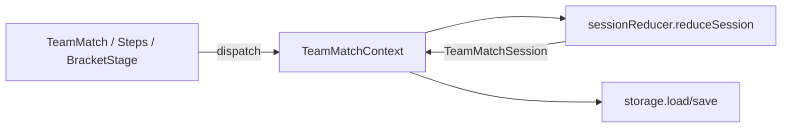

# TeamMatch（组队赛工具）代码架构说明

本文档描述 `src/pages/Tools/TeamMatch` 目录的整体架构、目录结构与主要模块职责，便于阅读与二次开发。

---

## 1. 功能概览

组队赛工具用于：**学校 / 选手登记 → 三人一队组队 → 种子成绩录入与确认 → 16 槽分区抽签 → 单淘汰正赛（每场两队各 3 人 PK 比总秒数）→ 领奖台展示**。  

- 向导步骤 `wizardStep`：`0` 学校与选手、`1` 组队、`2` 成绩录入、`3` 队伍确认、`4` 抽签；进入正赛后为 `6`（对阵图 + PK）、`7`（领奖台）。  
- 单场比赛状态存于 `TeamMatchSession`（见 `types.ts`），多场比赛根结构为 `TeamMatchStorageRoot`，通过 `localStorage` 持久化（键名 `STORAGE_KEY`）。  
- 正赛 UI 与 JSON 导入导出可附带 `LiveUISettings`（对阵页样式 + 全屏 PK 场样式），与 session 分离存储或打包进导出文件。

---

## 2. 目录结构

```
TeamMatch/
├── ARCHITECTURE.md          # 本说明
├── TeamMatch.tsx            # 页面入口：Provider、向导壳、历史列表、live 全屏分支
├── TeamMatch.less           # 页面与对阵/抽签等样式
├── TeamMatchSteps.tsx       # 向导 0–4 步具体内容（内嵌 StepTeam / StepScoreEntry 等）
├── TeamMatchContext.tsx     # React Context：根状态 + dispatch（会话级 reducer + 存储）
├── types.ts                 # 领域类型与常量（session、PK、签表、存储根等）
├── sessionFactory.ts        # 新建 session、normalizeSession（存档迁移与缺省字段）
├── sessionReducer.ts        # 纯函数 reduceSession：除「根级」外的所有 session 变更
├── storage.ts               # localStorage 读写、upsert/delete、防抖持久化
├── stepAccess.ts            # 步骤条点击是否允许跳转（前置条件校验）
│
├── bracketGen.ts            # 由 16 槽生成轮次、胜者晋级、铜牌战同步
├── bracketComplete.ts       # 签表是否打完、领奖台队伍 id 推导
├── drawRandom.ts            # 随机分区（按成绩 / 纯随机、同校避战等）
├── seedingMath.ts           # 队伍种子分、排序、正赛资格前 16 队
├── pkSettlement.ts          # 单场 PK 六条成绩如何判胜负（含双 DNF）
├── teamClassify.ts          # 学校队 / 自由人队判定、抽签用「虚拟校」id
├── seedingScorePick.ts      # 多来源成绩择优与「正式采用」解析
├── playerBracketDisplay.ts  # 对阵卡片等处展示用格式化
│
├── teamMatchJson.ts         # 比赛 JSON 导出/解析/下载
├── liveUiSettings.ts        # 正赛界面设置类型与 localStorage
├── pkArenaSettings.ts       # 全屏 PK 场默认样式（并入 LiveUISettings）
│
├── bulkFillSeeding.ts       # 批量拉取 WCA / One 写入 seeding
├── bulkOneUidImport.ts      # 粘贴批量匹配并更新选手 One UID
├── teamRosterPasteImport.ts # 粘贴导入学校/选手/队伍
├── oneCompPrelimImport.ts   # One 平台比赛初赛成绩预览与合并
├── oneGradeApi.ts           # One 平台 HTTP：用户成绩、比赛列表、轮次成绩
├── wcaSeeding.ts            # WCA 结果 JSON 里按项目取最佳单次/平均
├── wcaRequestThrottle.ts    # WCA 请求节流（成绩与头像）；粗饼头像节流
├── syncCubingAvatars.ts       # 经后端批量拉粗饼头像 URL 写入选手
├── wcaCubeEvents.ts         # 页面可选 WCA 项目列表
├── syncWcaAvatars.ts        # 批量拉 WCA 头像 URL 的逻辑
├── mockLocal.ts             # 测试数据：16 队预设、追加分组
│
├── bracketExportPng.ts      # 对阵图 DOM 导出 PNG
├── utils/
│   ├── wcaAvatar.ts         # 调 WCA API 取头像 thumb URL
│   ├── cubingAvatar.ts      # 调自家后端粗饼选手接口取 avatar_url
│   └── avatar.ts            # 本地图片裁剪为 JPEG data URL
│
└── components/              # UI 子组件（见第 5 节）
```

---

## 3. 架构与数据流

### 3.1 分层关系

| 层级 | 职责 |
|------|------|
| **页面** `TeamMatch.tsx` | 布局、历史会话列表、向导步骤条、live/podium 全屏模式、顶栏 JSON 工具条 |
| **状态** `TeamMatchContext.tsx` | `useReducer(storeReducer)`：HYDRATE / NEW / LOAD / DELETE 与委托 `reduceSession` |
| **领域逻辑** `sessionReducer.ts` 等 | 不依赖 React；可单测、可被 JSON 导入路径复用 |
| **持久化** `storage.ts` | 合并写 `sessions`、维护 `historyIds`（上限见 `HISTORY_LIMIT`）、`schedulePersist` 防抖 |

### 3.2 流程示意



- **导入 JSON**：`TeamMatchJsonToolbar` → `parseTeamMatchImport` → `dispatch({ type: 'HYDRATE', session })`。  
- **业务变更**：`dispatch(TeamMatchAction)` → `reduceSession` → `upsertSession` + `schedulePersist`。

### 3.3 签表与 PK

- `regionSlots`：4 区 × 4 槽；`flatSlots` 为行优先展开的 16 元组。  
- `drawRandom.randomizeDraw` 写入 `regionSlots` 并递增 `drawVersion`；`RANDOMIZE_DRAW` 还会 `rebuildBracketFromSession`。  
- `bracketGen.buildRoundsFromFlat16`：首轮 8 场相邻配对；后续轮次由 `advanceWinners` 根据子比赛 `winnerId` 填充并创建下轮 `pk`。  
- `bronzeMatch`：半决赛两场均有胜者后由 `syncBronzeFromSemis` 生成/更新。  
- PK 结算：`pkSettlement.computePkSettlement`；Reducer 中 `PK_SETTLE` / `PK_MANUAL_WINNER` / `PK_REPLAY` / `PK_CLEAR_CURRENT` 与 `cascadeRounds` 联动。

---

## 4. 根目录模块：文件与导出函数

### 4.1 `types.ts`

- **类型**：`TeamMatchSession`、`Team`、`Player`、`School`、`SeedingEntry`、`BracketMatch`、`PkMatchState`、存储根等。  
- **常量**：`TEAM_PLAYERS`（3）、`BRACKET_TEAM_COUNT`（16）、`MAX_ROSTER_TEAMS`（64）、`MIN_TEAMS`（8）、`HISTORY_LIMIT`、`STORAGE_KEY`。

### 4.2 `TeamMatchContext.tsx`

- `TeamMatchProvider`：挂载 Context 与 `useReducer`。  
- `loadFromStorage`：启动时选 `currentSessionId` 或历史第一条。  
- `storeReducer`：处理 `INIT`、`HYDRATE`、`NEW_SESSION`、`LOAD_SESSION`、`DELETE_SESSION`，其余转交 `reduceSession`。  
- `useTeamMatchStore`、`useTeamMatchDispatch`：消费 Context。

### 4.3 `sessionFactory.ts`

- `normalizeSession`：旧存档迁移（`wizardSchemaVersion`、`bronzeMatch`、`oneId`、`drawRandomMode` 等缺省补全）。  
- `createEmptySession`：新比赛初始空 session（含空 4×4 槽、默认项目 `333`）。

### 4.4 `sessionReducer.ts`

- `TeamMatchAction`：所有可 dispatch 的 session 级动作联合类型。  
- `reduceSession`：根据 action 更新 session（学校/选手/队伍/种子/抽签/签表/PK 等）。  
- `mergeSeeding`：保证每位选手 × 每个项目一条 `SeedingEntry`。  
- `buildPkTemplateRows`：为 PK 表单生成 6 行占位（A 队 3 人 + B 队 3 人）。  
- 内部辅助：`findMatch`、`setMatch`、`mapRounds`、`cascadeRounds` 等。  
- 再导出 `createEmptySession`（与 `sessionFactory` 同源，供外部按需引用）。

### 4.5 `storage.ts`

- `loadStorage` / `saveStorage`：读写 `TeamMatchStorageRoot`。  
- `upsertSession`：写入 session、置顶 `historyIds`、设 `currentSessionId`。  
- `deleteSession`：删条目并修正当前 id。  
- `metaFromSession`：历史列表展示用摘要。  
- `schedulePersist`：约 200ms 防抖落盘。

### 4.6 `stepAccess.ts`

- `canAccessWizardStep(session, target)`：`target` 为 0–4 时是否允许从步骤条跳入。

### 4.7 `bracketGen.ts`

- `syncBronzeFromSemis` / `syncBronzeToSession`：铜牌战与半决赛结果同步。  
- `buildRoundsFromFlat16`：16 槽 → 完整淘汰赛树（含首轮轮空 `byeWinnerId`）。  
- `advanceWinners`：根据上一轮胜者推进下一轮，处理永久双空子树等边界。  
- `rebuildBracketFromSession`：从 `flatSlots` 或 `regionSlots` 重建 `rounds` 与铜牌战。  
- `regionsToFlat`：4×4 → 16 元组。  
- `newSnapshotId`：PK 历史快照 id（uuid）。

### 4.8 `bracketComplete.ts`

- `semiLoserPair`：两场半决赛负者（用于跳过季军赛时并列第三）。  
- `isBracketFullyComplete`：主签表 +（若未跳过）铜牌战是否均有胜者。  
- `getPodiumTeamIds`：冠亚季（或跳过季军时的并列）队伍 id。

### 4.9 `drawRandom.ts`

- `randomizeDraw(session)`：返回新的 `regionSlots`（种子占位、同校避战、按成绩分段打乱等，见文件内注释）。  
- `regionsFromFlat`：flat → 四区。

### 4.10 `seedingMath.ts`

- `teamSeedingSum`：三人正式单次/平均之和是否有效。  
- `pickSeedTeamIds`：按规则取前 4 支种子队 id。  
- `teamSeedingSortMeta` / `sortTeamsBySeedingRank`：列表排序用。  
- `rankedBracketTeamIds`：正赛资格至多 16 支队伍 id 列表。

### 4.11 `pkSettlement.ts`

- `computePkSettlement`：双方三人成绩总和、DNF 规则、平局与双 DNF。  
- `formatResultValue`：展示用字符串。

### 4.12 `teamClassify.ts`

- `getFreelancerSchoolId`：自由人池学校 id。  
- `classifyTeamComposition`：三名队员 → 学校队或自由人队 + 归属 `schoolId`。  
- `defaultTeamName`：根据类型生成默认队名。  
- `schoolIdForDrawPairing`：抽签同校判断用「虚拟校」id。  
- `teamKindLabel`：UI 展示用文案。

### 4.13 `seedingScorePick.ts`

- `pickBestByAverage`：WCA / One / 初赛 中择优。  
- `resolveOfficialScores`：按 `SeedingAdoptStrategy` 解析正式单次与平均。  
- `SEEDING_SOURCE_LABEL` / `SEEDING_SOURCE_INLINE`：来源文案。

### 4.14 `playerBracketDisplay.ts`

- `fmtSeedingVal`、`seedingEntryForPlayer`、`formatPlayerSingleAverageLine`、`schoolNameForPlayer`：对阵 UI 辅助。

### 4.15 `teamMatchJson.ts`

- `TEAM_MATCH_JSON_FORMAT` / `TEAM_MATCH_JSON_VERSION`。  
- `buildTeamMatchJsonFile`、`parseTeamMatchImport`、`downloadTeamMatchJson`。

### 4.16 `liveUiSettings.ts`

- `BracketPageSettings`、`LiveUISettings` 类型。  
- `getDefaultBracketPageSettings`、`getDefaultLiveUISettings`。  
- `loadLiveUISettings`、`saveLiveUISettings`（含旧 key 迁移）。  
- `bracketSettingsToCssVars`：注入 CSS 变量供对阵根节点使用。

### 4.17 `pkArenaSettings.ts`

- `PkArenaSettings` 类型与 `getDefaultPkArenaSettings`。

### 4.18 `bulkFillSeeding.ts`

- `canBulkFillSeeding`：是否存在可拉取的 WCA / One id。  
- `bulkFillSeedingScores`：顺序请求 WCA 与 One，合并快照并按策略写回 `SeedingEntry`（支持 `AbortSignal`）。

### 4.19 `bulkOneUidImport.ts`

- `parseOneUidLine`、`parseBulkOneUidText`：粘贴文本解析。  
- `syncOneIdFromPaste`：按姓名匹配更新 `oneId`，返回统计与冲突信息。  
- 相关类型：`ParsedOneUidRow`、`SyncOneIdOutcome` 等。

### 4.20 `teamRosterPasteImport.ts`

- `parseTeamColumn`、`parsePlayerCell`、`splitPasteLine`：单元格解析。  
- `buildTeamRosterPasteImport`：合并进 session 的学校/选手/队伍增量。

### 4.21 `oneCompPrelimImport.ts`

- `oneCompRowToPreliminary`、`mergeDuplicateUidRows`。  
- `fetchOneCompPrelimPreview`：拉取并生成预览（不写 session）。  
- `fetchAndApplyOneCompPreliminary`：确认后写入 seeding（与 `mergeSeeding` / `resolveOfficialScores` 配合）。  
- 预览相关类型：`OneCompPrelimPreviewPlayerRow` 等。

### 4.22 `oneGradeApi.ts`

- `ONE_EID_TO_WCA_EVENT`、`wcaEventIdToOneEid`。  
- `fetchOneUserGrades`、`pickBestOneGradeForEvent`。  
- `fetchOneCommonCompList`、`fetchOneCompGrades` 及 `OneCompGradeRow` 等类型。

### 4.23 `wcaSeeding.ts`

- `wcaCentisecondsToSeconds`。  
- `pickBestForEvent`：从 WCA person results 里选当前项目最佳。

### 4.24 `wcaRequestThrottle.ts`

- `throttleBeforeWcaResultsRequest`、`throttleBeforeWcaAvatarRequest`、`throttleBeforeCubingAvatarRequest` 及间隔常量。

### 4.25 `wcaCubeEvents.ts`

- `TEAM_MATCH_WCA_EVENT_OPTIONS`：Select 选项。

### 4.26 `syncWcaAvatars.ts`

- `playersWithWcaId`。  
- `syncWcaAvatarsForPlayers`：节流请求 WCA profile（步骤回调类型 `WcaAvatarSyncStep`）。

### 4.26b `syncCubingAvatars.ts`

- `syncCubingAvatarsForPlayers`：经 `apiGetCubingChinaPerson` 取粗饼 `avatar_url`，写回 `avatarDataUrl`。

### 4.27 `mockLocal.ts`

- 预设校名、WCA ID、One UID、16 队编排常量。  
- `buildMockTeamMatchData`、`buildMockTeamMatchData16`、`appendMockGroups`。

### 4.28 `bracketExportPng.ts`

- `formatBracketExportFilename`、`exportBracketElementToPng`（html-to-image 等实现见源码）。

### 4.29 `utils/wcaAvatar.ts` / `utils/avatar.ts`

- `fetchWcaAvatarThumbUrl`：WCA profile 头像 URL。  
- `processAvatarFile`：裁剪压缩为 data URL。

---

## 5. `components/` 子目录

| 文件 | 作用 |
|------|------|
| `TeamMatchJsonToolbar` | 导出/导入 JSON、与 `teamMatchJson` 交互 |
| `LiveSettingsButton` / `LiveSettingsModal` | 编辑并应用 `LiveUISettings` |
| `TeamRosterPasteCard` | 触发粘贴导入，调用 `buildTeamRosterPasteImport` |
| `SyncWcaAvatarsButton` | 批量同步 WCA 头像 |
| `SyncCubingAvatarsButton` | 批量同步粗饼头像（后端 `/wca/cubing-china/person/:wcaID`） |
| `BulkOneUidImportModal` | 批量粘贴 One UID |
| `BulkFillSeedingButton` | 触发 `bulkFillSeedingScores` 与进度 |
| `OneCompPrelimImportCard` | One 比赛初赛导入 UI |
| `PlayerEditModal` | 单选手编辑（含 `AvatarUpload`） |
| `TeamEditModal` | 组队弹窗，调用 `classifyTeamComposition` |
| `SeedingPlayerModal` | 单选手种子成绩、来源策略、拉 WCA/One |
| `PreliminaryBatchModal` | 批量初赛成绩表 |
| `BracketStage` | 正赛对阵树、`PkModal`/`PkArenaFullscreen`、导出 PNG、跳过季军赛开关 |
| `PkModal` | 桌面端 PK 录入与结算按钮 |
| `PkArenaFullscreen` | 全屏对战展示（读 `PkArenaSettings`） |
| `PodiumStage` | 领奖台（依赖 `getPodiumTeamIds`） |
| `AvatarUpload` | 头像裁剪上传，调用 `processAvatarFile` |

---

## 6. 相关路由

菜单与路由在仓库 `config/routes.ts` 及 `src/locales/*/menu.ts` 中注册到本页面；具体 path 以项目配置为准。

---

*文档随代码演进可能滞后；若与实现不一致，以源码为准。*
